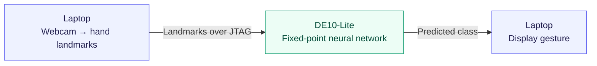

<div align="center">

# FPGA Hand Gesture Classifier

A five-gesture classifier with a neural network implemented in Verilog on a DE10-Lite FPGA. Python handles webcam tracking; the FPGA runs fixed-point inference and returns the prediction over USB-Blaster JTAG.


*The overlay compares the PyTorch prediction with the class returned by the board.*

</div>

## Engineering overview

- **Model:** a 42 → 32 → 32 → 5 MLP trained in PyTorch on hand landmarks. Classes are fist, open palm, peace, thumbs up and point.
- **Fixed-point implementation:** signed 16-bit Q4.12 inputs and weights, 32-bit accumulation, layer-specific shifts and saturation. A Python reference mirrors the hardware arithmetic.
- **Verilog design:** three sequential dense layers, each reusing a multiply-accumulate unit across its neurons, followed by argmax.
- **Board interface:** a packet controller and JTAG UART connect the classifier to Python through a local TCP/Tcl bridge in Quartus System Console.



## Results

Reported results from the project's 2,348-sample dataset and DE10-Lite build:

| Measure | Result |
| --- | --- |
| PyTorch float accuracy | 98.3% |
| Python fixed-point accuracy | 97.87% |
| RTL verification | Bit-exact comparison against 40 golden vectors |
| Logic elements | 6,459 / 49,760 (13%) |
| Embedded 9-bit multipliers | 6 / 288 (2%) |

Quantisation reduced accuracy by 0.43 percentage points.

## Latency breakdown

Reported timings for the same network, excluding webcam capture and MediaPipe:

| Inference implementation | Time per classification |
| --- | --- |
| Laptop, PyTorch float | ~38 µs |
| Laptop, pure-Python fixed-point | ~180 µs |
| DE10-Lite MLP core, RTL simulation | ~27 µs |

The board's communication overhead is much larger than its compute time:

| Board round-trip component | Time |
| --- | --- |
| MLP inference, simulated | ~0.027 ms |
| JTAG transfer, polling and host overhead, estimated from round trip | ~208 ms |
| Full board round trip, measured median | ~208 ms |

The overhead estimate subtracts the simulated inference time from the measured round trip; it is not a separate transfer measurement. At this precision, both round to 208 ms.

The FPGA core is faster in these reported timings, but the USB-Blaster JTAG link limits the demo to about 4.8 classifications per second. Running the model on the laptop is faster end to end in this setup. A faster board interface would be needed to benefit from the FPGA's inference latency.

## Run it

The supplied setup uses **Windows, Python 3.12, Quartus Prime Lite and a DE10-Lite**. A trained model and exported weights are included.

From the repository root in PowerShell:

```powershell
py -3.12 -m venv .venv
.\.venv\Scripts\Activate.ps1
python -m pip install -r software/requirements.txt
```

1. Open [`hardware/quartusD/gesture_classifier.qpf`](hardware/quartusD/gesture_classifier.qpf) in Quartus and compile it.
2. Program the generated `output_files/gesture_classifier.sof` through USB-Blaster.
3. Close other JTAG UART clients, then start the demo:

```powershell
python software/demo.py
```

The demo starts the System Console bridge automatically. If Quartus is installed elsewhere, set `SYSTEM_CONSOLE` to your `system-console.exe` path before running it. The default is `C:\altera_lite\25.1std\quartus\sopc_builder\bin\system-console.exe`.

Without a board connection, the demo falls back to the software model. Press `q` to quit or `r` to start/stop GIF recording.

## Validation

Python tests cover preprocessing, the model and fixed-point arithmetic:

```powershell
python -m pip install pytest
python -m pytest tests/ -v
```

For RTL simulation, install Icarus Verilog in `C:\iverilog\bin`, or set `IVERILOG_BIN` to its bin directory:

```powershell
cd hardware/sim
.\run_sim_iverilog.ps1
.\run_glue_iverilog.ps1
```

The first testbench compares MLP outputs with 40 golden vectors. The second checks packet reception, inference and the reply path. Both should report PASS.

## Code guide

| Location | Contents |
| --- | --- |
| [`software/`](software/) | Landmark capture, training, fixed-point reference, weight export and live demo |
| [`hardware/rtl/`](hardware/rtl/) | MAC, dense layers, MLP and packet controller |
| [`hardware/quartusD/`](hardware/quartusD/) | Board project, JTAG UART and Tcl bridge |
| [`hardware/sim/`](hardware/sim/) | RTL testbenches and simulation scripts |
| [`models/`](models/) | Trained PyTorch model and quantised weight ROMs |
| [`tests/`](tests/) | Python unit tests |

To train a new model, run `software/capture.py`, `software/train.py` and `software/export_weights.py` in that order from the repository root. Then rerun validation and rebuild the FPGA image with the new weights.
